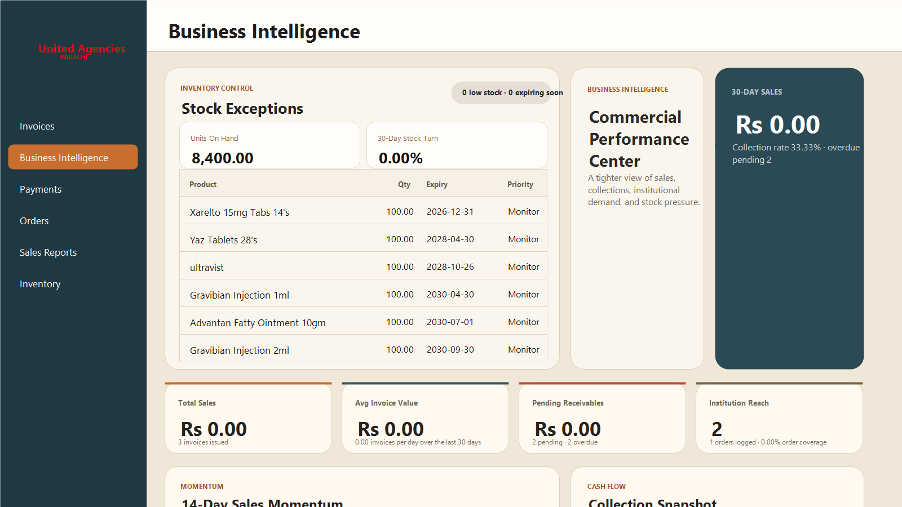

# United Agencies Karachi ERP

Desktop ERP for United Agencies Karachi, built with Electron for office invoicing, inventory control, order tracking, payments, and business intelligence.



## Overview

United Agencies Karachi ERP is an internal desktop application for pharmaceutical distribution operations. It keeps invoices, inventory, orders, receivables, and commercial reporting in one place, with a Windows desktop interface designed for day-to-day office use.

## Features

- Invoice management with bill numbers, challan details, order references, inspection notes, invoice dates, and institution/customer details.
- Product selection from inventory while creating invoices, including stock deduction after save.
- Inventory records with registration number, batch number, manufacturing date, expiry date, quantity, trade price, and discount fields.
- Order logging with institution name, order number, order date, and attached order files.
- Payment tracking for pending and received receivables.
- Business Intelligence dashboard for sales, collections, institution reach, inventory pressure, stock turn, and payment aging.
- PDF invoice generation through the bundled Python helper.
- Local SQLite support plus PostgreSQL configuration for shared office database deployments.

## Tech Stack

- Electron
- JavaScript, HTML, and CSS
- SQLite through Electron's Node integration layer
- PostgreSQL through `pg`
- Python helper scripts for PDF generation
- Electron Builder for Windows installer packaging

## Project Structure

```text
.
+-- electron-app/
|   +-- backend/              # Python helpers for authentication/PDF workflows
|   +-- renderer/             # Desktop UI HTML, CSS, and JavaScript
|   +-- assets/               # Application branding assets
|   +-- main.js               # Electron main process and data IPC handlers
|   +-- preload.js            # Safe renderer bridge
|   +-- package.json          # Electron app scripts and packaging metadata
+-- docs/screenshots/         # README and GitHub presentation images
+-- UnitedDrugsApi/           # API project, if used by the deployment
+-- UnitedDrugsDotNet/        # .NET project, if used by the deployment
```

## Getting Started

### Prerequisites

- Node.js 20 or newer
- npm
- Python available as `python` on Windows if PDF generation is used
- PostgreSQL credentials if running against a shared database

### Run the Desktop App

```bash
cd electron-app
npm install
npm start
```

The app opens as a desktop window.

### Database Configuration

The app can use a PostgreSQL connection string from `POSTGRES_URL`, or a `db.config.json` file beside `electron-app/main.js` or in the app data directory.

Start from the example file:

```bash
cd electron-app
copy db.config.example.json db.config.json
```

Then update the host, database, user, password, and SSL settings for the target environment.

## Build for Windows

```bash
cd electron-app
npm run dist
```

The Windows installer output is written to `electron-app/dist/`.

## Repository Notes

Do not commit local databases, generated invoice PDFs, build artifacts, or installed dependencies. The `.gitignore` keeps those files out of GitHub while preserving the source, docs, and app assets.
